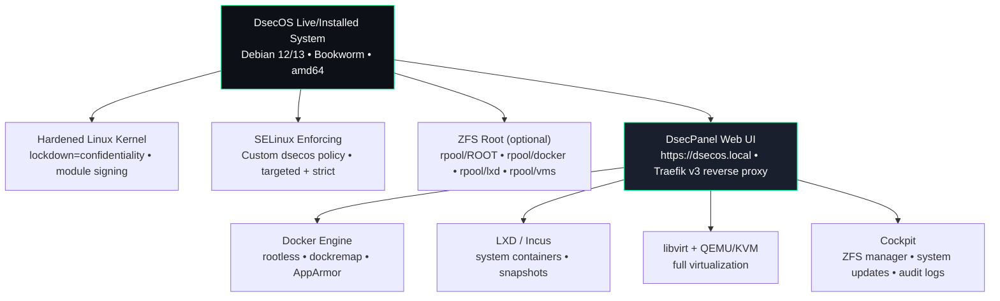
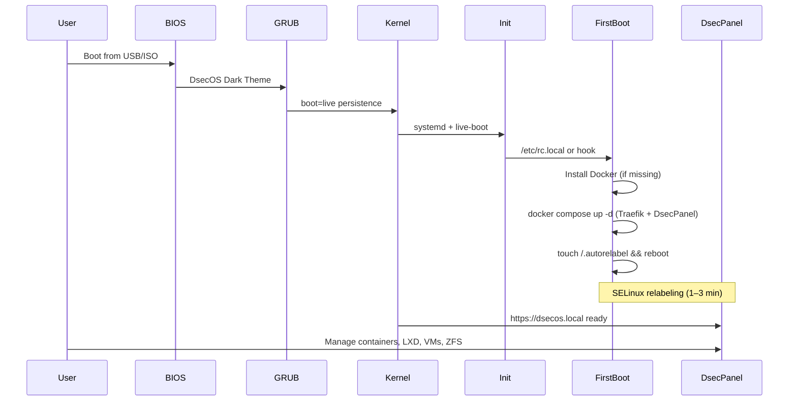
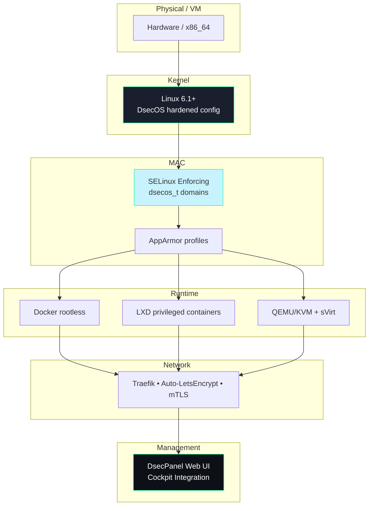
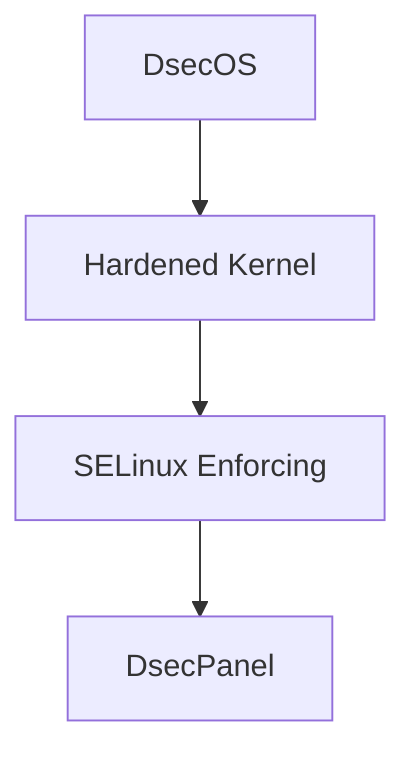

Here are the **official DsecOS architecture diagrams** in clean, copy-pasteable **Mermaid.js** syntax — perfect for README.md, docs site, or presentations.

### 1. High-Level System Architecture (Hero Diagram)


### 2. Module System Architecture (SOLID in Action)

```mermaid
graph LR
    Build[./build.sh] --> Loader[scripts/module_loader.py<br/>SOLID Module Registry]
    
    Loader --> M00[modules/00-base]
    Loader --> M10[modules/10-selinux]
    Loader --> M20[modules/20-zfs]
    Loader --> M30[modules/30-docker]
    Loader --> M40[modules/40-lxd]
    Loader --> M50[modules/50-kvm]
    Loader --> M60[modules/60-dsecpanel]
    Loader --> M90[modules/90-hardening]
    Loader --> M99[modules/99-themes]

    M00 -->|package-lists/*.chroot| LB[live-build config/]
    M10 -->|includes.chroot/etc/selinux| LB
    M60 -->|hooks.live/*.hook.chroot| LB
    M99 -->|includes.binary/*| LB

    LB --> ISO[DsecOS ISO<br/>live-image-amd64.hybrid.iso]
    
    style Loader fill:#00ff9d,color:#000
    style ISO fill:#0d1117,stroke:#00ff9d,stroke-width:4px
```


### 3. First-Boot & Runtime Flow


### 4. Security Layers Stack


### 5. Repository Structure (Tree View)
```bash
"dsecos/ (monorepo)"
  "modules/"
    "00-base/"
    "10-selinux/"
    "20-zfs/"
    "30-docker/"
    "40-lxd/"
    "50-kvm/"
    "60-dsecpanel/"
    "70-traefik/"
    "80-cockpit/"
    "90-hardening/"
    "99-themes/"
  "config/"
    "package-lists/"
    "includes.chroot/"
    "includes.binary/"
    "hooks.live/"
  "scripts/"
    "module_loader.py"
    "build.sh"
  "ansible/"
  "installer/"
  "assets/branding/"
    "dsecos-wallpaper.jpg"
    "logo.svg"
    "grub-background.png"
```


